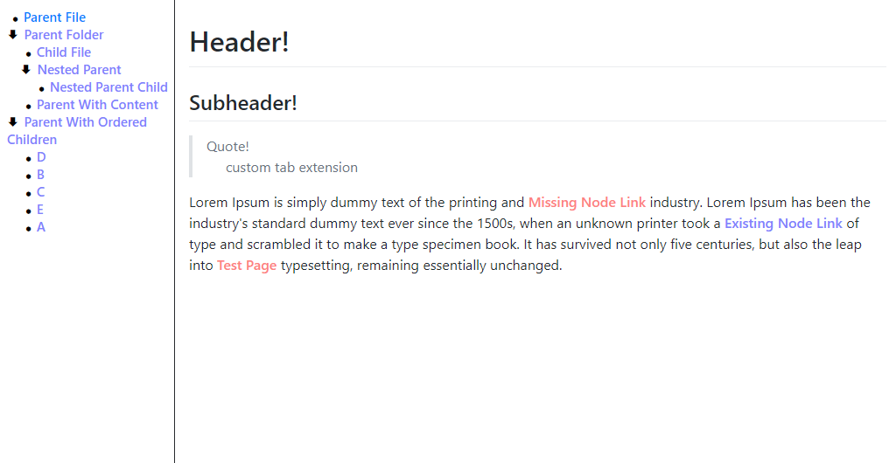

# Generator

Generator is an application which creates static websites resembling a wiki from markdown files. You can view a live demo of the latest build at [https://cryru.github.io/Generator/](https://cryru.github.io/Generator/)

## Usage

*Get the latest release from the ["Releases"](https://github.com/Cryru/Generator/releases) section.*

Create a folder named "Source" and place your markdown files inside. The application .exe should be in the same folder as the "Source" folder. The name and path of this folder can be configured, refer to the "Configuration" section. Run Generator.exe and you'll have a new folder called "Output" with your generated wiki (hopefully).

Pages will be generated from the folder structure inside your "Source"" folder, you can control the order by placing an "order.txt" file in the folder and listing the names of the files in the order you want them to appear. The markdown file for the folder node itself is read from a "Folder.md" if any.

If you launch "Generator.exe sentry" from the command line the generator will launch in "sentry mode", rebuilding the output directory when it detects a file has changed or has been added/removed from the source directory. 

For an example check the Documentation/DemoSource folder in the repo.

## Configuration

The first time the application is launched it will generate a default settings file - "settings.xml"
Within it you can customize things such as your source folder. For information on the different options refer to the "Configuration.cs" class and the comments inside.

## Markdown Extensions

Apart from supporting numerous markdown syntax (thanks Markdig!) there are some additional functionalities.

### Node Links

Links will be colored blue, missing links will be red.

``[[node name]]`` will create a link to another node with the name within the brackets.

``[[text]](node name)`` will create a link to another node with the name specified in the round brackets retaining the text within the square brackets.

### Other

``[\t]`` will place four "html spaces". This can be used to indent markdown in places where the specification doesn't allow.

## Features

- Treeview style navigation bar with folding.
- Node links.
- Configurable folders.
- Configurable html templates.
- Browser navigation and url retention.
- Works without any server hosting the content.
- Minimal JavaScript.

## Projects Used

- [Markdig](https://github.com/lunet-io/markdig) is used to render the markdown pages to html.
- Net Core 3
- [The Guide](https://github.com/cryru/theguide) for inspiration.
